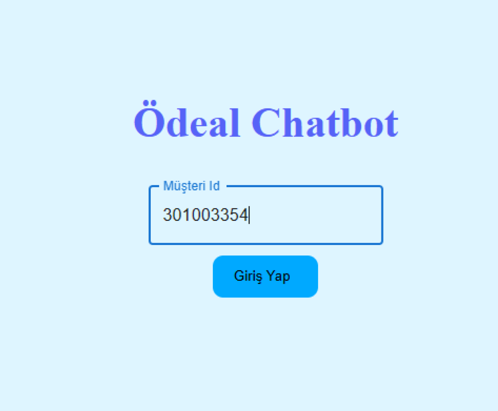
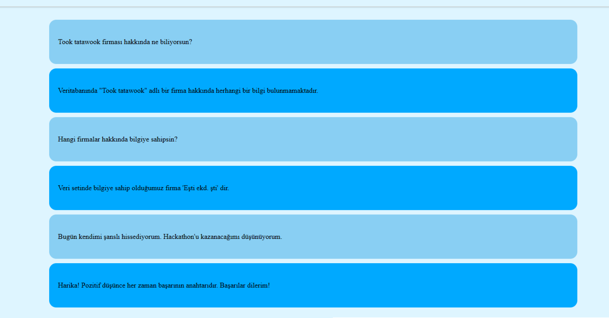
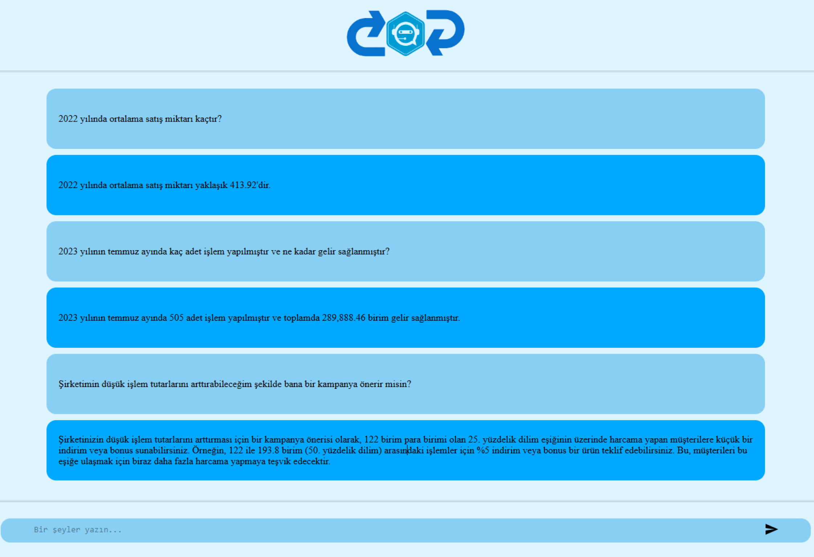
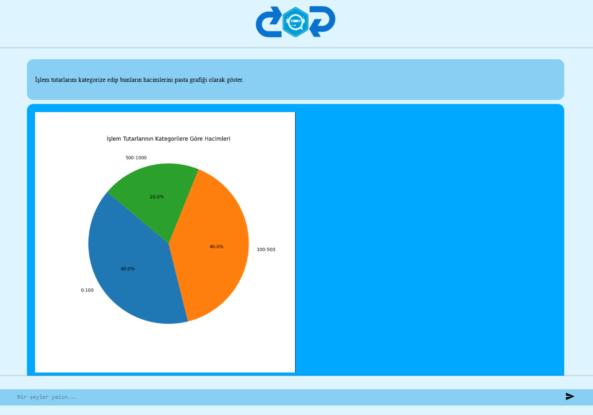
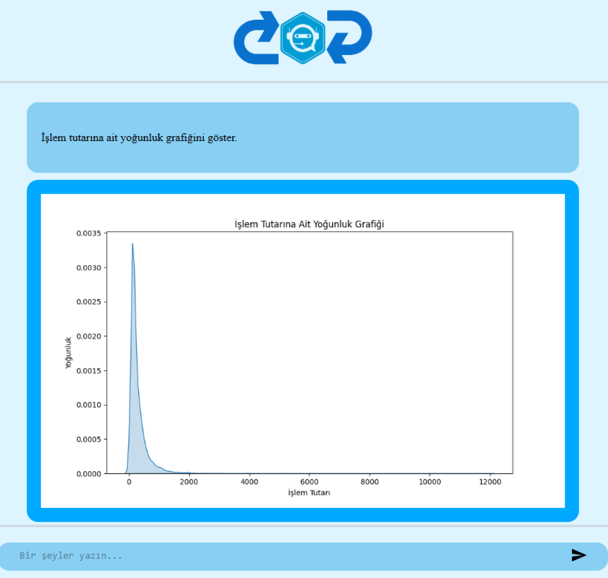
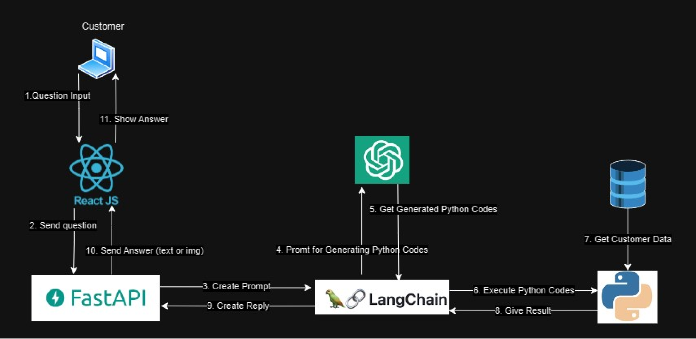

# Ödeal GPT AI Hackathon

Bu repo, Ödeal GPT AI Hackathon için bbt-ai ekibinin projesini içerir. Ekip üyeleri şunlardır:

- [Batuhan Mutlu](https://github.com/batuhanmtl)
- [Yusuf Demir](https://github.com/yusufdemyr)

## Proje Tanıtımı

Bu projenin amacı, Ödeal üye işyerlerinin kullanacağı bir LLM (Large Language Model) tabanlı AI uygulaması geliştirmektir. Bu uygulama, Ödeal müşterilerinin işlem geçmişi ve gelecekteki işlemleriyle ilgili sorular sormalarına ve cevap almalarına yardımcı olacaktır. Ayrıca, müşterilere gelecekteki işlemleri artırmak için öneriler sunacak.

## Uygulamadan Resimler











### Uygulamanın Mimarisi



## Örnek Kullanım

Bu AI chatbot, kullanıcıların işlem geçmişi ile ilgili sorulara doğru cevaplar verecek ve işlem verilerini anlayarak sorulara yanıtlayacaktır. Örnek sorgular ve cevapları şunlar olabilir:

- "2022 Eylül ayında toplamda kaç adet işlem yapmışım ve toplamda ne kadar kazanmışım?"
  - Bot, veritabanındaki işlem verilerini analiz ederek bu soruya yanıt verecektir.
- "Düşük işlem tutarlarını arttıracak yönde 1 adet kampanya öner."
  - Bot, müşterilerin tercihleri üzerinden kişiselleştirilmiş öneriler sunabilir.

Projemizin amacı, Ödeal müşterilerine daha iyi hizmet sunmak ve işlem verilerini daha verimli bir şekilde kullanarak işlerini büyütmektir. Bu chatbot, kullanıcıların daha iyi bilgilendirilmesine ve gelecekteki işlemlerini artırmalarına yardımcı olacak önemli bir araç olacaktır.

## Kurulum

Projeyi yerel makinenizde çalıştırmak veya geliştirmek için aşağıdaki adımları izleyin:

1. Repo'yu klonlayın:

   ```bash
   git clone https://github.com/yusufdemyr/Odeal-GPT-AI-Hackathon.git
   ```
   
2. Chatbot klasörünü açın.

3. Öncelikle `api` klasöründen backend'i çalıştırın:
   
    + Sanal ortamı (virtual environment) oluşturun ve etkinleştirin:
      ```bash
      python -m venv env
      .\env\Scripts\activate
      ```
    + Gerekli bağımlılıkları yükleyin:
      ```bash
      pip install -r requirements.txt
      ```
    + API'yi çalıştırın:
      ```bash
      uvicorn main:app --reload
      ```
  
4. Ardından frontend klasöründen başka bir komut satırı ile arayüzü başlatın:
    - Gerekli paketleri yükleyin:
      ```bash
      npm install
      ```
    - Geliştirme modunda projeyi başlatın:
      ```bash
      npm run dev
      ```
5. Hazırsınız! Müşteri ID'nizi girerek botumuzu kullanmaya başlayabilirsiniz.

**Not**: API anahtarınızı `main.py` dosyasındaki `os.environ["OPENAI_API_KEY"]` satırına eklemeyi unutmayın.
